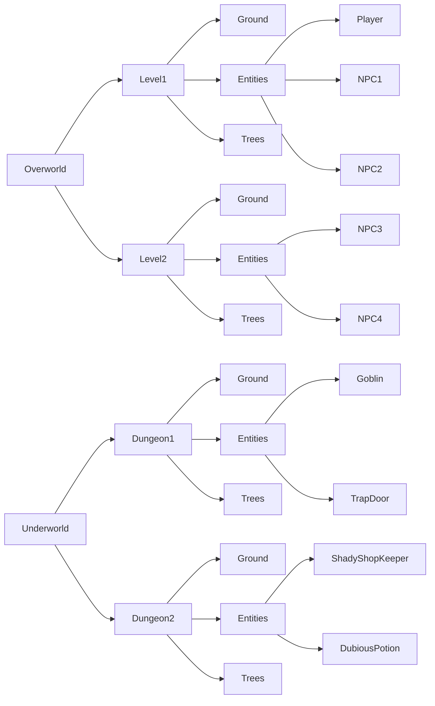

# bevy_ldtk_asset

[](https://github.com/stinkytoe/bevy_ldtk_asset/tree/main#license)
[](https://docs.rs/bevy_ldtk_asset/latest/bevy_ldtk_asset/)
[](https://crates.io/crates/bevy_ldtk_asset/)
[](https://github.com/stinkytoe/bevy_ldtk_asset/actions)

A plugin for the [Bevy Engine](https://bevyengine.org) for loading projects
from the [LDtk](https://ldtk.io) level editor.

## Description

This plugin aims to provide an asset through Bevy's asset loader system, providing
access to the data in an LDtk project.

### Philosophy

This crate attempts to provide the user with data that can readily be introduced
into Bevy, but does not attempt to offer opinions on how this data should be used.
No components, systems (except for debug output), events, resources, etc are provided.

### Conventions

When possible, we will convert items to a Bevy compatible format.

* Fields describing a color will be stored as a [bevy color](https://docs.rs/bevy/latest/bevy/color/enum.Color.html)
* If the field describes a location in space, we will use an [I64Vec2](https://docs.rs/bevy/latest/bevy/math/struct.Vec2.html)
  * NOTE: LDtk, and by extension, this library, uses the convention that the y-axis
  is positive down. Implementers will need to take care to invert the y-axis when
  creating components in Bevy's screen space, such as the transform vector in a
  [Transform](https://docs.rs/bevy/latest/bevy/prelude/struct.Transform.html) Component.
  * NOTE: This behavior changed in v0.6.0 .
* If the field describes a location within an image, we will use a [I64Vec2](https://docs.rs/bevy/latest/bevy/math/struct.I64Vec2.html)
* Images will be stored as a `Handle<Image>`
* Numeric fields which aren't coerced into a Bevy type will stored in an appropriate
  64 bit field (`u64`, `i64`, `f64`)
* `Iid`'s are parsed into our local [Iid] type. It is considered undefined behavior
  if these fail to be unique
* `Uid`'s are represented by the [Uid] type, which is of type `i64`
* LDtk pivot fields are converted to and stored as [Anchor](https://docs.rs/bevy/latest/bevy/sprite/enum.Anchor.html)
  fields

## Assets

An LDtk project is loaded using Bevy's asset system, and can be added as a
`Handle<Project>` to an ECS entity using the asset server:

```rust
#[Derive(Component)]
struct MyComponent {
    project_handle: Handle<bevy_ldtk_asset::project::Project>,
}

fn example_system(mut commands: Commands, asset_server: Res<AssetServer>) {
    commands.spawn(MyComponent {
        project_handle: asset_server.load("some_project.ldtk");
    })
}
```

### Asset labeling

An LDtk project is based on a hierarchical structure where a world (or worlds)
contains levels, levels contain layers, and layers can either contain tiles or
entities.

These objects are loaded as labeled sub assets of the main project, with their
identifiers acting as their labels. LDtk entities will also have their Iid appended
after a '@' character.

For instance, an LDtk project with a layout like:



Would result in the following assets and sub-assets being generated:

```text
example.ldtk
example.ldtk#worlds:Overworld
example.ldtk#worlds:Overworld/Level1
example.ldtk#worlds:Overworld/Level1/Ground
example.ldtk#worlds:Overworld/Level1/Entities
example.ldtk#worlds:Overworld/Level1/Entities/Player@e594faf8-fe91-4a25-8082-95ff47040f43
example.ldtk#worlds:Overworld/Level1/Entities/NPC1@d4465592-92ba-4fd7-80c2-7a315d4368be
example.ldtk#worlds:Overworld/Level1/Entities/NPC2@355ad2ee-fbbb-4d30-b5b9-4711ea699121
example.ldtk#worlds:Overworld/Level1/Trees
example.ldtk#worlds:Overworld/Level2
example.ldtk#worlds:Overworld/Level2/Ground
example.ldtk#worlds:Overworld/Level2/Entities
example.ldtk#worlds:Overworld/Level2/Entities/NPC3@8ff0db7d-2969-459a-8f54-467f67aa669f
example.ldtk#worlds:Overworld/Level2/Entities/NPC4@492dceab-8884-4188-90aa-61662444f501
example.ldtk#worlds:Overworld/Level2/Trees
example.ldtk#worlds:Underworld
example.ldtk#worlds:Underworld/Dungeon1
example.ldtk#worlds:Underworld/Dungeon1/Ground
example.ldtk#worlds:Underworld/Dungeon1/Entities
example.ldtk#worlds:Underworld/Dungeon1/Entities/Goblin@c528ae1d-4625-4999-a184-d061253d0595
example.ldtk#worlds:Underworld/Dungeon1/Entities/TrapDoor@2a91e6b2-d63b-4d90-9e5a-f860eea82afd
example.ldtk#worlds:Underworld/Dungeon1/Trees
example.ldtk#worlds:Underworld/Dungeon2
example.ldtk#worlds:Underworld/Dungeon2/Ground
example.ldtk#worlds:Underworld/Dungeon2/Entities
example.ldtk#worlds:Underworld/Dungeon2/Entities/ShadyShopKeeper@55ae7dac-3158-41d1-a8c0-8b586ad19f4c
example.ldtk#worlds:Underworld/Dungeon2/Entities/DubiousPotion@14500cf9-0bd3-440e-b7d0-085a64e79493
example.ldtk#worlds:Underworld/Dungeon2/Trees
example.ldtk#tileset_definitions:GroundTilemap
example.ldtk#tileset_definitions:PlayerTilemap
example.ldtk#tileset_definitions:NpcTilemap
example.ldtk#tileset_definitions:DubiousPotionIcon
example.ldtk#entity_definitions:Player
example.ldtk#entity_definitions:NPC1
example.ldtk#entity_definitions:NPC2
example.ldtk#entity_definitions:NPC3
example.ldtk#entity_definitions:NPC4
example.ldtk#entity_definitions:Goblin
example.ldtk#entity_definitions:TrapDoor
example.ldtk#entity_definitions:ShadyShopKeeper
example.ldtk#entity_definitions:DubiousPotion
example.ldtk#layer_definitions:Ground
example.ldtk#layer_definitions:Entities
example.ldtk#layer_definitions:Trees
```

See [asset_labels] for a full description.

### LDtk dependencies (Images, etc)

An LDtk project will itself point to other assets, such as [Image] files used
for tile maps. For these to also work in [Bevy](https://bevyengine.org), these
assets should be in the same asset storage as the `.ldtk` file. Typically this
will be the Rust crate's assets folder. `bevy_ldtk_asset` will attempt to
reconcile the locations of these assets by assuming the paths in the `.ldtk`
file are relative to the file itself, and that those paths also exist
within the same asset storage location as the `.ldtk` file.

### External Levels

LDtk enabled the option to save levels into separate files, with extension `.ldtkl`.

This is fully supported by this plugin, however they cannot be loaded directly. The
entire project file must be loaded, though a user can simply refer to the level's
asset path directly. See [Asset Labeling](#asset-labeling).

Unfortunately there is metadata in the main project which is needed to properly
describe a level, and all of it's sub assets. So, loading the entire project is
the only option.

### Multi Worlds Projects

Originally LDtk only supported a single 'World' per project file. In these
projects, the world does not have an identifier or its own Iid. Recently they
have added an option for multi world projects.

For single world projects, we add the identifier of "World", and clone the Iid
of the project in order to build our World asset.

### Naming Collisions

Unfortunately, there are many name collisions between the nomenclature used in
Bevy and LDtk. Especially (but not exclusively):

* World
* Level
* Layer
* Entity

I will endeavor to refer to objects in Bevy as ECS objects, i.e. an
ECS entity or ECS world when referring to objects from the Bevy ecosystem, and
LDtk objects for things either from this library or LDtk itself, i.e. an LDtk
entity or LDtk world.

Users are recommended to use the `use ... as ...` pattern in their own code when
importing these types to help avoid any pitfalls, such as:

```rust
use bevy_ldtk_asset::project::Project as ProjectAsset;
```

## Getting Started

### Dependencies

This project depends on the Bevy engine, and will therefore inherit its
dependencies. See
[Installing OS Dependencies](https://bevyengine.org/learn/quick-start/getting-started/setup/#installing-os-dependencies)
from Bevy's documentation for instructions.

### Installing

You can add this plugin to your project using Cargo:

```bash
cargo add bevy_ldtk_asset # from within your project directory
```

Or by adding to your `Cargo.toml` file:

```toml
[dependencies]
bevy_ldtk_asset = "0.5"
```

## Help

Please report any issues to me via my GitHub page:
[github](https://github.com/stinkytoe)
or by filing an issue:
[bevy_ldtk_asset issues](https://github.com/stinkytoe/bevy_ldtk_asset/issues)

## Authors

stinkytoe
[github](https://github.com/stinkytoe)
[email](mailto:stinkytoe42@yahoo.com)

## Version History

* 0.5:
  * Release for Bevy 0.15 (WIP!)
* 0.4 and prior:
  * archived...

## Capabilities

* [x] Single World and Multi World projects
* [x] External Level Files
* [ ] Aseprite Files [#20](https://github.com/stinkytoe/bevy_ldtk_asset/issues/20)
* [ ] Table of Contents export
* [x] Layer Definitions
* [x] Entity Definitions
* [x] Tileset Definitions
* [x] Enum Definitions
* [x] Nine-Slice Borders for Entities

Embedded Atlas
[see #35](https://github.com/stinkytoe/bevy_ldtk_asset/issues/35)

## Compatability

| bevy_ldtk_asset | bevy        | LDtk  |
| :-------------: | :---------: | :---: |
| 0.5.1           | 0.15.0-rc.3 | 1.5.3 |
| 0.5.0           | 0.15.0-rc.3 | 1.5.3 |

## License

This project is dual-licensed under either the MIT or Apache-2.0 license:

MIT License ([LICENSE-MIT](LICENSE-MIT) or [http://opensource.org/licenses/MIT](http://opensource.org/licenses/MIT))

Apache License, Version 2.0 ([LICENSE-APACHE](LICENSE-APACHE) or [http://www.apache.org/licenses/LICENSE-2.0](http://www.apache.org/licenses/LICENSE-2.0))

## Acknowledgments

This project would not exist without the awesome efforts of the Bevy team, and
Deepknight of Deepknight Games!

[bevy](https://bevyengine.org)

[LDtk](https://ldtk.io)
