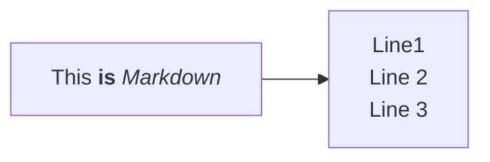

# Project Title

A plugin for the [Bevy Engine](https://bevyengine.org) to allow loading of
projects from the [LDtk](https://ldtk.io) level editor.

## Description

This plugin aims to provide an asset through Bevy's asset loader system, providing
access to the data in an LDtk project.

### Naming Collisions

Unfortunately, there are many name collisions between the nomenclature used in
Bevy and LDtk. Especially:

* World
* Layer
* Entity

I will endeavor to refer to objects in Bevy/Rust as ecs objects, i.e. an
ecs entity or ecs world when referring to objects from the Bevy ecosystem, and
LDtk objects for things either from this library or LDtk itself, i.e. an LDtk
entity or LDtk world.

### The Assets

An LDtk project is loaded using Bevy's asset system, and can be added as a
`Handle<Project>` to an ECS entity using the asset server:

```rust
fn example_system(mut commands: Commands, asset_server: Res<AssetServer>) {
  commands.spawn(asset_server.load::<Project>("some_project.ldtk"));
}
```

### Asset labeling

An LDtk project is based on a hierarchical structure where a world (or worlds)
contains levels, levels contain layers, and layers can either contain tiles or
entities.

These objects are loaded as labeled sub assets of the main project, with their
identifiers acting as their labels. LDtk entities will also have their Iid appended
after a '@' character.

For instance, an LDtk project with a layout like:



## Getting Started

### Dependencies

This project depends on the Bevy engine, and will therefore inherit its
dependencies. See
[Installing OS Dependencies](https://bevyengine.org/learn/quick-start/getting-started/setup/#installing-os-dependencies)
from Bevy's documentation.

### Installing

You can add this plugin to your project by adding it as a crate to your Cargo
project in the normal way using Cargo:

```bash
cargo add bevy_ldtk_asset # from within your project directory
```

Or by adding to your `Cargo.toml` file:

```toml
[dependencies]
bevy_ldtk_asset = "0.5"
```

## Help

Please report any issues to me via my GitHub page:
[github](https://github.com/stinkytoe)
or by filing an issue:
[bevy_ldtk_asset issues](https://github.com/stinkytoe/bevy_ldtk_asset/issues)

## Authors

stinkytoe
[github](https://github.com/stinkytoe)
[email](stinkytoe42@yahoo.com)

## Version History

* 0.5:
  * Release for Bevy 0.14 (WIP!)
* 0.4 and prior:
  * archived...

## Compatability

The minor version of this project will target a specific minor version of Bevy.

| bevy | bevy_ldtk_asset |
| :--: | :-------------: |
| 0.14 | 0.5             |

## License

This project is dual-licensed under either the MIT or Apache-2.0 license:

* MIT License ([LICENSE-MIT](LICENSE-MIT) or [http://opensource.org/licenses/MIT](http://opensource.org/licenses/MIT))
* Apache License, Version 2.0 ([LICENSE-APACHE](LICENSE-APACHE) or [http://www.apache.org/licenses/LICENSE-2.0](http://www.apache.org/licenses/LICENSE-2.0))

## Acknowledgments

This project would not exist without the awesome efforts of the Bevy team, and
Deepknight of Deepknight Games!
