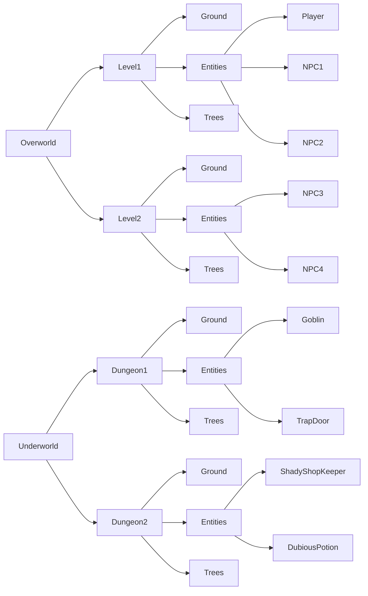

# Project Title

A plugin for the [Bevy Engine](https://bevyengine.org) to allow loading of
projects from the [LDtk](https://ldtk.io) level editor.

## Description

This plugin aims to provide an asset through Bevy's asset loader system, providing
access to the data in an LDtk project.

---
NOTE:

Previous versions of this plugin would attempt to spawn ecs entities for the
user. This functionality has been removed, but will be added to a separate crate
in the future. See: [shieldtank](https://github.com/stinkytoe/shieldtank)

---

### Naming Collisions

Unfortunately, there are many name collisions between the nomenclature used in
Bevy and LDtk. Especially:

* World
* Layer
* Entity

I will endeavor to refer to objects in Bevy/Rust as ecs objects, i.e. an
ecs entity or ecs world when referring to objects from the Bevy ecosystem, and
LDtk objects for things either from this library or LDtk itself, i.e. an LDtk
entity or LDtk world.

## Assets

An LDtk project is loaded using Bevy's asset system, and can be added as a
`Handle<Project>` to an ECS entity using the asset server:

```rust
fn example_system(mut commands: Commands, asset_server: Res<AssetServer>) {
  commands.spawn(asset_server.load::<Project>("some_project.ldtk"));
}
```

### Asset labeling

An LDtk project is based on a hierarchical structure where a world (or worlds)
contains levels, levels contain layers, and layers can either contain tiles or
entities.

These objects are loaded as labeled sub assets of the main project, with their
identifiers acting as their labels. LDtk entities will also have their Iid appended
after a '@' character.

For instance, an LDtk project with a layout like:



Would result in the following assets and sub-assets being generated:

```text
example.ldtk
example.ldtk#Overworld
example.ldtk#Overworld/Level1
example.ldtk#Overworld/Level1/Ground
example.ldtk#Overworld/Level1/Entities
example.ldtk#Overworld/Level1/Entities/Player@e594faf8-fe91-4a25-8082-95ff47040f43
example.ldtk#Overworld/Level1/Entities/NPC1@d4465592-92ba-4fd7-80c2-7a315d4368be
example.ldtk#Overworld/Level1/Entities/NPC2@355ad2ee-fbbb-4d30-b5b9-4711ea699121
example.ldtk#Overworld/Level1/Trees
example.ldtk#Overworld/Level2
example.ldtk#Overworld/Level2/Ground
example.ldtk#Overworld/Level2/Entities
example.ldtk#Overworld/Level2/Entities/NPC3@8ff0db7d-2969-459a-8f54-467f67aa669f
example.ldtk#Overworld/Level2/Entities/NPC4@492dceab-8884-4188-90aa-61662444f501
example.ldtk#Overworld/Level2/Trees
example.ldtk#Underworld
example.ldtk#Underworld/Dungeon1
example.ldtk#Underworld/Dungeon1/Ground
example.ldtk#Underworld/Dungeon1/Entities
example.ldtk#Underworld/Dungeon1/Entities/Goblin@c528ae1d-4625-4999-a184-d061253d0595
example.ldtk#Underworld/Dungeon1/Entities/TrapDoor@2a91e6b2-d63b-4d90-9e5a-f860eea82afd
example.ldtk#Underworld/Dungeon1/Trees
example.ldtk#Underworld/Dungeon2
example.ldtk#Underworld/Dungeon2/Ground
example.ldtk#Underworld/Dungeon2/Entities
example.ldtk#Underworld/Dungeon2/Entities/ShadyShopKeeper@55ae7dac-3158-41d1-a8c0-8b586ad19f4c
example.ldtk#Underworld/Dungeon2/Entities/DubiousPotion@14500cf9-0bd3-440e-b7d0-085a64e79493
example.ldtk#Underworld/Dungeon2/Trees
```

## Getting Started

### Dependencies

This project depends on the Bevy engine, and will therefore inherit its
dependencies. See
[Installing OS Dependencies](https://bevyengine.org/learn/quick-start/getting-started/setup/#installing-os-dependencies)
from Bevy's documentation.

### Installing

You can add this plugin to your project using Cargo:

```bash
cargo add bevy_ldtk_asset # from within your project directory
```

Or by adding to your `Cargo.toml` file:

```toml
[dependencies]
bevy_ldtk_asset = "0.5"
```

## Help

Please report any issues to me via my GitHub page:
[github](https://github.com/stinkytoe)
or by filing an issue:
[bevy_ldtk_asset issues](https://github.com/stinkytoe/bevy_ldtk_asset/issues)

## Authors

stinkytoe
[github](https://github.com/stinkytoe)
[email](stinkytoe42@yahoo.com)

## Version History

* 0.5:
  * Release for Bevy 0.14 (WIP!)
* 0.4 and prior:
  * archived...

## Capabilities

* [x] Single World and Multi World supported
* [x] External Level Files
* [ ] Aseprite Files
* [ ] Level Background Generation
  * lala
* [ ] Layer Background Generation
* [ ] #18

* [ ] <https://github.com/stinkytoe/bevy_ldtk_asset/issues/18>

## Compatability

The minor version of this project will target a specific minor version of Bevy.

| bevy_ldtk_asset | bevy | LDtk |
| :--: | :-------------: | :--: |
| 0.5.0 | 0.14             | 1.5.3 |

## License

This project is dual-licensed under either the MIT or Apache-2.0 license:

* MIT License ([LICENSE-MIT](LICENSE-MIT) or [http://opensource.org/licenses/MIT](http://opensource.org/licenses/MIT))
* Apache License, Version 2.0 ([LICENSE-APACHE](LICENSE-APACHE) or [http://www.apache.org/licenses/LICENSE-2.0](http://www.apache.org/licenses/LICENSE-2.0))

## Acknowledgments

This project would not exist without the awesome efforts of the Bevy team, and
Deepknight of Deepknight Games!
